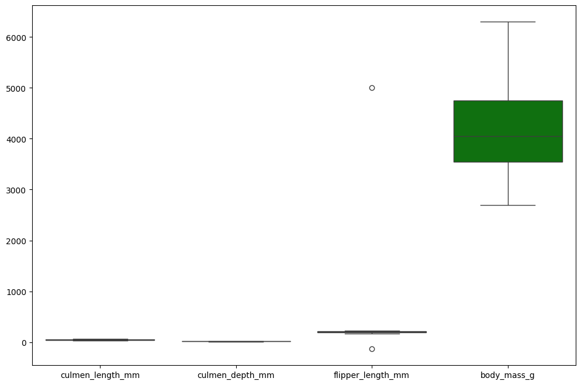
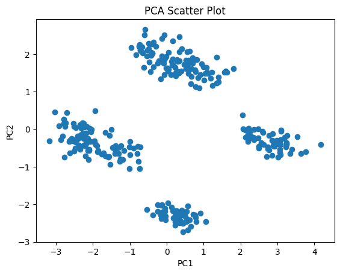
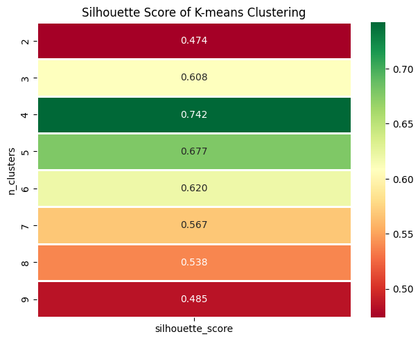
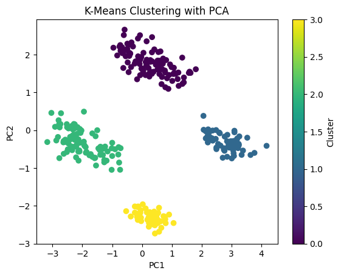

# Principal Component Analysis (PCA) and K-Means Algorithm in Python


## Goal
The implementation of Principal Component Analysis (PCA) and K-Means using Python aims to help readers understand how to apply these techniques in practice.

## Objective
1. **Understanding the Dataset**: Read the dataset using Python and perform initial exploration such as checking dimensions, feature types, and value distributions.  
2. **Data Preprocessing**: Check for null values, anomalies, outliers, and perform feature encoding for categorical variables to ensure the data is ready for processing.  
3. **Feature Scaling**: Standardize the data using Z-Score Normalization to ensure feature values are on the same scale.  
4. **Principal Component Analysis (PCA)**: Apply PCA to reduce the dataset's dimensionality and select the number of principal components based on the explained variance ratio.  
5. **K-Means Clustering**: Use the PCA results to fit the K-Means model with the optimal number of clusters and generate the cluster column.
6. **Elbow Method** : Use elbow method to determine optimal cluster for modeliing with K-Means.
7. **Model Evaluation**: Evaluate the clustering results using the Silhouette Score to assess the clustering quality.  
8. **Result Visualization**: Visualize the clustering results with scatter plots to observe patterns and cluster separations.  

## Dataset [Click Here](https://www.kaggle.com/datasets/youssefaboelwafa/clustering-penguins-species)
| Feature Name         | Description                                                                 |
|----------------------|-----------------------------------------------------------------------------|
| `culmen_length_mm`   | The length of the penguin's culmen (beak) measured in millimeters (mm).     |
| `culmen_depth_mm`    | The depth of the penguin's culmen (beak) measured in millimeters (mm).      |
| `flipper_length_mm`  | The length of the penguin's flippers measured in millimeters (mm).          |
| `body_mass_g`        | The body mass of the penguin measured in grams (g).                        |
| `sex`                | The sex of the penguin, typically recorded as either male or female.       |

## Model and Metric Evaluation
1. Principal Component Analysis
2. K-Means Clustering
3. Silhouette Score (Metric Evaluation)

## Tools
1. JupyterLab / Juptyer Notebook
2. Python Programming Language

## Contact Information
- **Email:** [yogaapril0504@gmail.com](mailto:yogaapril0504@gmail.com)
- **LinkedIn:** [Yoga Aprila](https://www.linkedin.com/in/yoga-aprila/)

## Data Preprocessing 
### 1. Outlier


There are outliers in `flipper_length_mm' column so decided to remove the outliers.

### 2. Anomalies
| Sex    | Count |
|--------|-------|
| MALE   | 167   |
| FEMALE | 165   |
| .      | 1     |

Drop '.' in `sex` column.

### 3. Missing Value
| Feature Name         | Missing Values |
|----------------------|----------------|
| culmen_length_mm     | 0              |
| culmen_depth_mm      | 0              |
| flipper_length_mm    | 0              |
| body_mass_g          | 0              |
| sex                  | 7              |

The sex column contains 7 missing rows, leading to its removal.

### 4. Feature Encoding
| Index | culmen_length_mm | culmen_depth_mm | flipper_length_mm | body_mass_g | sex_FEMALE | sex_MALE |
|-------|------------------|-----------------|-------------------|-------------|------------|----------|
| 0     | 39.1             | 18.7            | 181.0             | 3750.0      | 0          | 1        |
| 1     | 39.5             | 17.4            | 186.0             | 3800.0      | 1          | 0        |
| 2     | 40.3             | 18.0            | 195.0             | 3250.0      | 1          | 0        |
| 4     | 36.7             | 19.3            | 193.0             | 3450.0      | 1          | 0        |
| 5     | 39.3             | 20.6            | 190.0             | 3650.0      | 0          | 1        |

The 'sex' column will undergo one-hot encoding, creating sex_MALE and sex_FEMALE columns.

## Standardization
Standardization is used to standardize features by removing the mean and scaling to unit variance. It is an essential preprocessing step in machine learning to ensure that all features contribute equally to the model and are on a comparable scale. Many machine learning algorithms (e.g., SVM, K-Means, PCA) are sensitive to the scale of data. Standardizing ensures that no feature dominates due to its larger magnitude. The transformed data will have a mean of 0 and a standard deviation of 1 for each feature.

| Feature              | Count | Mean            | Std Dev  | Min       | 25%       | 50%       | 75%       | Max       |
|----------------------|-------|-----------------|----------|-----------|-----------|-----------|-----------|-----------|
| culmen_length_mm     | 332.0 | -4.708416e-16   | 1.001509 | -2.189667 | -0.830434 | 0.124703  | 0.845648  | 2.861539  |
| culmen_depth_mm      | 332.0 | 1.284113e-16    | 1.001509 | -2.070694 | -0.793438 | 0.075096  | 0.790360  | 2.220887  |
| flipper_length_mm    | 332.0 | 7.276642e-16    | 1.001509 | -2.067519 | -0.783164 | -0.283693 | 0.857956  | 2.142311  |
| body_mass_g          | 332.0 | 4.280378e-17    | 1.001509 | -1.871059 | -0.815350 | -0.225395 | 0.713876  | 2.600180  |
| sex_FEMALE           | 332.0 | 1.391123e-16    | 1.001509 | -0.993994 | -0.993994 | -0.993994 | 1.006042  | 1.006042  |
| sex_MALE             | 332.0 | -1.391123e-16   | 1.001509 | -1.006042 | -1.006042 | 0.993994  | 0.993994  | 0.993994  |


## Principal Component Analysis (PCA) 
```python
pca = PCA(n_components=2)  # for example, selecting 2 principal components
principal_components = pca.fit_transform(data_scaled)  # fit the data using PCA
df_pca = pd.DataFrame(data=principal_components, columns=['PC1', 'PC2'])  # convert to dataframe
```

for example, we are using two principal component named **PC1** and **PC2**. we will see total Explained Variance Ration and total explained variance :
 
**Explained Variance Ratio**:  
- Component 1: 0.52034062  
- Component 2: 0.34463112  

**Total Explained Variance**:  
- 0.8649717341499124

The first two principal components capture the majority of the variance (86.50%) in the data, which indicates that these components retain most of the information in the original dataset.



## Elbow Method


## K-Means

Based on silhoutte score, four clusters give best silhoutte score.

## Cluster Visualization


## Conclusion 
1. By using PCA, the dataset with 6 features is reduced to 2 features while retaining approximately 86% of the original information, which can significantly speed up computation.
2. The PCA results are then implemented with K-Means to create a cluster column, which is subsequently evaluated using the Silhouette Score.
3. If further analysis of each cluster is needed, the cluster column resulting from PCA and K-Means can be added back to the original dataset to gain deeper insights into the characteristics of each cluster.
